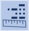
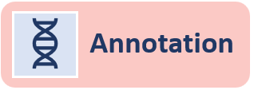

{:toc}

# What is Biofilter?
Biofilter is a software tool that provides a convenient single interface for accessing multiple publicly available human genetic data sources. These sources include information about the genomic locations of SNPs and genes, as well as relationships among genes and proteins such as interaction pairs, pathways and ontological categories. Biofilter will cross-reference all of this prior biological knowledge in several different ways, with any number of combinations of input data.

# Why use Biofilter?
While genome-wide association studies (GWAS) have been used to identify genetic variants that contribute to disease susceptibility on a single-variant single-phenotype level, other approaches can be used to investigate the association between genetic and phenotypic variation. Use of the software tool Biofilter is one such example of a complementary but alternate approach. Biofilter allows users to work with a range of types and formats of data, including SNPs, copy number variant (CNV), and gene location information, along with a repository of diverse biological knowledge distilled from multiple external databases. Via Biofilter, users can annotate data or results with relevant biological knowledge for analysis and interpretation.  Biofilter also allows users to filter data based on biological criteria, allowing users to harness information from multiple sources for the reduction of data for analysis. Finally, Biofilter can be used to generate biological-information derived pairwise interaction models for reducing the computational and statistical burden of large-scale interaction data analysis, while also providing a biological foundation to support the relevance of statistically significant results. The use of Biofilter may help to elucidate a new picture of the relationship between genetic architecture and complex phenotypic outcomes such as the presence or absence of disease. 

# Data Schema

# Data Types

|Symbol|Data Type|Description|
|---|---|---|
|**SNP**||Specified by an RS number, i.e. “rs12345678”; Used to refer to a known and documented SNP whose position can be retrieved from LOKI|
|**Position**||Specified by a chromosome and basepair location, i.e. “chr1:234”; Used to refer to any single genomic location, such as a SNP, SNV, rare variant, or any other position of interest|
|**Region**||Specified by a chromosome and basepair range, i.e. “chr1:234-567”; Used to refer to any genomic region, such as CNV, insertion/deletion (indel), gene coding region, evolutionarily conserved region (ECR), functional region, regulatory region, or any other region of interest|
|**Gene**||Specified by a name or other identifier, i.e. “ABG1” or “ENSG00000123456”; used to refer to a known or documented gene, whose genomic region and associations with any pathways, interactions, or other groups can be retrieved from LOKI|
|**Group**||Specified by a name or other identified, i.e. “inflammatory process” or “GO:0001234”; Used to refer to known and documented pathway, protein families, ontological group, interaction pairs, or any groupings of genes, proteins, genomic regions, or diseases|
|**Source**||Specified by name, i.e. “GAAD” or “DisGeNET”; Used to refer to a specific external data source|

# Analysis Modes

|**Filtering**||Given input data, Biofilter can cross-reference it using stored relationships to generate a filtered dataset of supported data types|
|**Annotation**||As opposed to ‘Filtering’, input data can be annotated with additional properties without subsetting the original list provided|
|**Filtering**||In addition to cross-referencing stored relationships, combo of input data can be used to reduce the search space with pairwise interactions models and groupings|

# Primary and Alternative Input Datasets

# Identifiers

# Data Schema

# Open-Source Code
* [Ritchie Lab GitHub](https://github.com/RitchieLab/biofilter)

# References
- Holzinger ER, Verma SS, Moore CB, Hall M, De R, Gilbert-Diamond D, Lanktree MB, Pankratz N, Amuzu A, Burt A, Dale C, Dudek S, Furlong CE, Gaunt TR, Kim DS, Riess H, Sivapalaratnam S, Tragante V, van Iperen EPA, Brautbar A, Carrell DS, Crosslin DR, Jarvik GP, Kuivaniemi H, Kullo IJ, Larson EB, Rasmussen-Torvik LJ, Tromp G, Baumert J, Cruickshanks KJ, Farrall M, Hingorani AD, Hovingh GK, Kleber ME, Klein BE, Klein R, Koenig W, Lange LA, Mӓrz W, North KE, Charlotte Onland-Moret N, Reiner AP, Talmud PJ, van der Schouw YT, Wilson JG, Kivimaki M, Kumari M, Moore JH, Drenos F, Asselbergs FW, Keating BJ, Ritchie MD. Discovery and replication of SNP-SNP interactions for quantitative lipid traits in over 60,000 individuals. BioData Min. 2017 Jul 24;10:25. doi: 10.1186/s13040-017-0145-5. PMID: 28770004; PMCID: PMC5525436.

- Kim D, Lucas A, Glessner J, Verma SS, Bradford Y, Li R, Frase AT, Hakonarson H, Peissig P, Brilliant M, Ritchie MD. Biofilter as a Functional Annotation Pipeline for Common and Rare Copy Number Burden. Pac Symp Biocomput. 2016;21:357-68. PMID: 26776200; PMCID: PMC4722964.

- Pendergrass SA, Verma SS, Holzinger ER, Moore CB, Wallace J, Dudek SM, Huggins W, Kitchner T, Waudby C, Berg R, McCarty CA, Ritchie MD. Next-generation analysis of cataracts: determining knowledge driven gene-gene interactions using Biofilter, and gene-environment interactions using the PhenX Toolkit. Pac Symp Biocomput. 2013:147-58. Corrected and republished in: Pac Symp Biocomput. 2015;:495-505. PMID: 23424120; PMCID: PMC3615413.

- Hohman TJ, Bush WS, Jiang L, Brown-Gentry KD, Torstenson ES, Dudek SM, Mukherjee S, Naj A, Kunkle BW, Ritchie MD, Martin ER, Schellenberg GD, Mayeux R, Farrer LA, Pericak-Vance MA, Haines JL, Thornton-Wells TA; Alzheimer's Disease Genetics Consortium. Discovery of gene-gene interactions across multiple independent data sets of late onset Alzheimer disease from the Alzheimer Disease Genetics Consortium. Neurobiol Aging. 2016 Feb;38:141-150. doi: 10.1016/j.neurobiolaging.2015.10.031. Epub 2015 Nov 6. PMID: 26827652; PMCID: PMC4735733.

- Hall MA, Verma SS, Wallace J, Lucas A, Berg RL, Connolly J, Crawford DC, Crosslin DR, de Andrade M, Doheny KF, Haines JL, Harley JB, Jarvik GP, Kitchner T, Kuivaniemi H, Larson EB, Carrell DS, Tromp G, Vrabec TR, Pendergrass SA, McCarty CA, Ritchie MD. Biology-Driven Gene-Gene Interaction Analysis of Age-Related Cataract in the eMERGE Network. Genet Epidemiol. 2015 Jul;39(5):376-84. doi: 10.1002/gepi.21902. Epub 2015 May 17. PMID: 25982363; PMCID: PMC4550090.

- Pendergrass SA, Frase A, Wallace J, Wolfe D, Katiyar N, Moore C, Ritchie MD. Genomic analyses with biofilter 2.0: knowledge driven filtering, annotation, and model development. BioData Min. 2013 Dec 30;6(1):25. doi: 10.1186/1756-0381-6-25. PMID: 24378202; PMCID: PMC3917600.

- De R, Verma SS, Holzinger E, Hall M, Burt A, Carrell DS, Crosslin DR, Jarvik GP, Kuivaniemi H, Kullo IJ, Lange LA, Lanktree MB, Larson EB, North KE, Reiner AP, Tragante V, Tromp G, Wilson JG, Asselbergs FW, Drenos F, Moore JH, Ritchie MD, Keating B, Gilbert-Diamond D. Identifying gene-gene interactions that are highly associated with four quantitative lipid traits across multiple cohorts. Hum Genet. 2017 Feb;136(2):165-178. doi: 10.1007/s00439-016-1738-7. Epub 2016 Nov 15. PMID: 27848076.

- Grady BJ, Torstenson ES, McLaren PJ, DE Bakker PI, Haas DW, Robbins GK, Gulick RM, Haubrich R, Ribaudo H, Ritchie MD. Use of biological knowledge to inform the analysis of gene-gene interactions involved in modulating virologic failure with efavirenz-containing treatment regimens in ART-naïve ACTG clinical trials participants. Pac Symp Biocomput. 2011:253-64. doi: 10.1142/9789814335058_0027. PMID: 21121053; PMCID: PMC3094912.

- Bush WS, Dudek SM, Ritchie MD. Biofilter: a knowledge-integration system for the multi-locus analysis of genome-wide association studies. Pac Symp Biocomput. 2009:368-79. PMID: 19209715; PMCID: PMC2859610.

