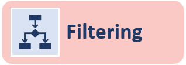

{:toc}

# What is Biofilter?
Biofilter is a software tool that provides a convenient single interface for accessing multiple publicly available human genetic data sources. These sources include information about the genomic locations of SNPs and genes, as well as relationships among genes and proteins such as interaction pairs, pathways and ontological categories. Biofilter will cross-reference all of this prior biological knowledge in several different ways, with any number of combinations of input data.

# Why use Biofilter?
While genome-wide association studies (GWAS) have been used to identify genetic variants that contribute to disease susceptibility on a single-variant single-phenotype level, other approaches can be used to investigate the association between genetic and phenotypic variation. Use of the software tool Biofilter is one such example of a complementary but alternate approach. Biofilter allows users to work with a range of types and formats of data, including SNPs, copy number variant (CNV), and gene location information, along with a repository of diverse biological knowledge distilled from multiple external databases. Via Biofilter, users can annotate data or results with relevant biological knowledge for analysis and interpretation.  Biofilter also allows users to filter data based on biological criteria, allowing users to harness information from multiple sources for the reduction of data for analysis. Finally, Biofilter can be used to generate biological-information derived pairwise interaction models for reducing the computational and statistical burden of large-scale interaction data analysis, while also providing a biological foundation to support the relevance of statistically significant results. The use of Biofilter may help to elucidate a new picture of the relationship between genetic architecture and complex phenotypic outcomes such as the presence or absence of disease. 

# Data Schema

# Data Types

|Symbol|Data Type|Description|
|---|---|---|
|**SNP**||Specified by an RS number, i.e. “rs12345678”; Used to refer to a known and documented SNP whose position can be retrieved from LOKI|
|**Position**||Specified by a chromosome and basepair location, i.e. “chr1:234”; Used to refer to any single genomic location, such as a SNP, SNV, rare variant, or any other position of interest|
|**Region**||Specified by a chromosome and basepair range, i.e. “chr1:234-567”; Used to refer to any genomic region, such as CNV, insertion/deletion (indel), gene coding region, evolutionarily conserved region (ECR), functional region, regulatory region, or any other region of interest|
|**Gene**||Specified by a name or other identifier, i.e. “ABG1” or “ENSG00000123456”; used to refer to a known or documented gene, whose genomic region and associations with any pathways, interactions, or other groups can be retrieved from LOKI|
|**Group**||Specified by a name or other identified, i.e. “inflammatory process” or “GO:0001234”; Used to refer to known and documented pathway, protein families, ontological group, interaction pairs, or any groupings of genes, proteins, genomic regions, or diseases|
|**Source**||Specified by name, i.e. “GAAD” or “DisGeNET”; Used to refer to a specific external data source|

# Analysis Modes

|**Filtering**||Given input data, Biofilter can cross-reference it using stored relationships to generate a filtered dataset of supported data types|
|**Annotation**||As opposed to ‘Filtering’, input data can be annotated with additional properties without subsetting the original list provided|
|**Filtering**||In addition to cross-referencing stored relationships, combo of input data can be used to reduce the search space with pairwise interactions models and groupings|

# Primary and Alternative Input Datasets

# Identifiers

# Data Schema

# Open-Source Code
* [Ritchie Lab GitHub](https://github.com/RitchieLab/biofilter)

