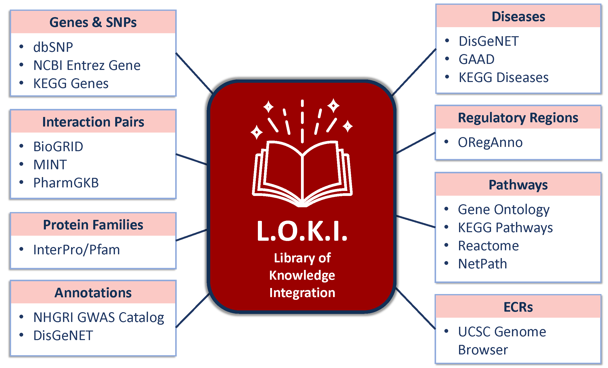

{:toc}

# Library of Knowledge Integration ('LOKI')
Rather than issuing queries in real-time to a series of external databases, Biofilter consults a local database called the Library of Knowledge Integration, or LOKI. This local repository contains all the knowledge from bulk downloads of the raw data from each external source. 

LOKI must be generated on the local system before Biofilter can be used, but because the resulting knowledge database is a single local file, Biofilter itself does not require an internet connection to run. The process of building LOKI requires a relatively large amount of time and disk space to complete, but only needs to be done occasionally to incorporate updated data files from the various sources. 

# Knowledge Sources

|Data Source|Use|Scope|Description|
|---|---|---|---|
|BioGRID| | |A repository with genetic and protein interaction used by Biofilter for linking position and region data to interaction information|
|NCBI dbSNP| | |A database with base pair locations for SNPs, insertions, deletions, microsatellites, and non-polymorphic variants for a human reference genome used by Biofilter to map genomics positions and connect retired identifiers to current identifiers|
|DisGeNET| | |One of the largest collections of genes and variants involved in human diseases used by Biofilter for gene-disease associations|
|NCBI Entrez Gene| | |A database with extensive list of known human genes, base pair positions, and many alternate names plus cross-referenced database identifiers used by Biofilter to connect gene symbols to their genomic regions and equivalent gene symbols|
|Gene Autoimmune Diseases Association (GAAD)| | |A database containing over 44,000 associations between nearly 50 autoimmune diseases and over 4,000 genes from public databases and MEDLINE documents used by Biofilter to annotate immunogenetic associations|
|Gene Ontology (GO)| | |An ontology which defines terms representing gene product properties, such as cellular components, molecular function, and biological processes, within a hierarchical tree of ontology groups and related proteins.|
|NHGRI GWAS Catalog| | |A database for associations between SNPs and various phenotypes which were discovered via genome-wide association studies|
|KEGG Pathways| | |One of the most comprehensive and widely accessed database resource for understanding high-level biological functions used by Biofilter to access KEGG Pathway for molecular interactions, reactions, and relation networks for metabolism, genetic information processing, environmental information processing, cellular processes, and organism systems|
|KEGG Genes| | |A collection of genes and proteins in complete genomes from NCBI RefSeq and GenBank and annotated by KEGG in the form of KO (KEGG Orthology) assignment, supplemented with functionally characterized proteins from published literature|
|KEGG Diseases| | |A collection of disease entries focusing only on diseases as perturbed states and genetic and environmental factors, plus drugs, are considered perturbants to the molecular system|
|Molecular Interaction (MINT)| | |A collection of experimentally verified protein-protein interactions mined from literature by experts|
|NetPath Database| | |A database consists of curated human signal transduction pathways used by Biofilter as one type of pathway-level information|
|Open REGulatory ANNOtation (ORegAnno)| | |An open-source for community-based annotation of experimentally identified DNA regulatory regions, transcription factor binding sites and regulatory variants used by Biofilter as a source of information for known regulatory elements|
|InterPro (formerly Pfam)| | |A database of known protein families used by Biofilter to map annotations to proteins|
|Pharmacogenomics Knowledgebase (PharmGKB)| | |A knowledge base of human genetic variation on drug response used by Biofilter for pathway-based data|
|Reactome| | |A manually curated and peer-reviewed database used by Biofilter for pathway and network relationships between genes|
|UCSC Genome Browser| | |An interactive online and downloadable resource with genome sequence and alignment data for major model organisms used by Biofilter to access location information for evolutionarily-conserved regions (ECRs) and ORegAnno's regulatory region data|
